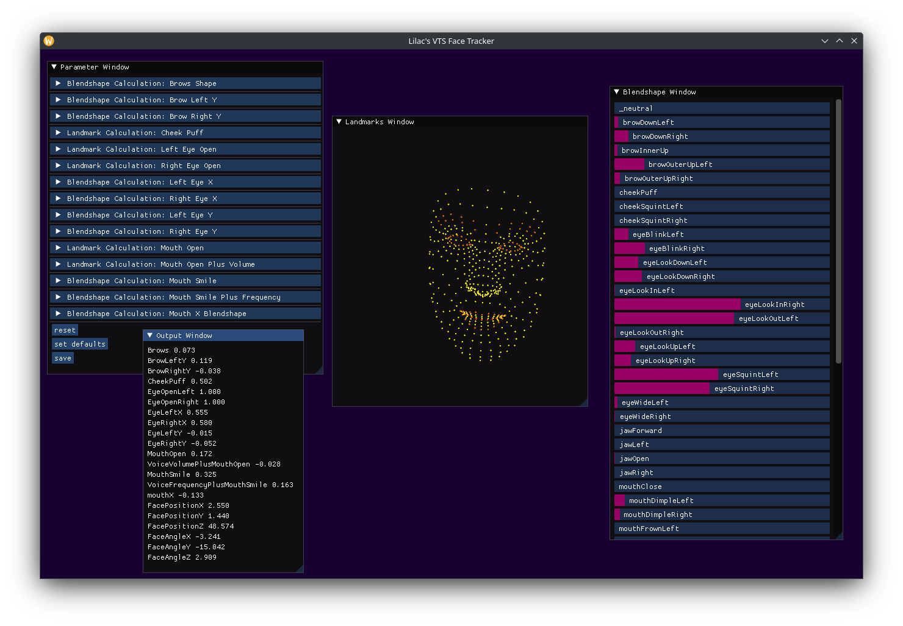

# lilacs-vts-tracker
A VTube Studio camera-based face tracker plugin for linux built on top of google's mediapipe.

Mediapipe face landmarker model attained from google via

```
$ wget -O face_landmarker_v2_with_blendshapes.task -q https://storage.googleapis.com/mediapipe-models/face_landmarker/face_landmarker/float16/1/face_landmarker.task
```

Python Requirements: mediapipe, websockets, scikit-image, pyimgui[sdl2] python version 3.9 - 3.12 (see [requirements.txt](./requirements.txt))

App Requirements: OpenGL version >= v3.3

Recommend running in a virtual environment

### Venv Setup
This was done on arch linux with the python3.12 package as pyimgui does not yet support python3.13.
```
$ python3.12 -m venv .venv
```
This command creates a `.venv` directory  to store the virtual environment
```
$ source .venv/bin/activate
```
This sets the python version / pip version to the version inside of `.venv`. This must be run before executing any code.
```
$ pip install -r requirements.txt
```
This installs the python dependencies according to the [requirements.txt](./requirements.txt) file.

## Main Program

Run `python main.py` while an instance of vtube studio is open. VTube Studio will ask you to authorize the program, and once you do it will begin to inject the data into the defined parameters.

To run the program without connecting to vtube studio add the argument `--run_offline`.
To launch the GUI application, add the argument `--run_app`

Other parameters are described when running `python main.py --help`


## Application



A GUI application has been added to view inputs and tune parameters. This will only appear when running with the `--run-app` argument when running main.py.

### Landmarks Window
This window draws all of the landmark points detected by the input model.

### Blendshape Window
This window shows a list of all blendshapes that were output by the model, as well as their value (between 0 and 1)

### Parameter Window
This window lists all parameters that are being created. The first line specifies the output (see the output window section below)

There are two types of parameters: blendshape and landmark.
All parameters have 5 base parameters, a scale, offset, clamp, max and min. What this does is take the output value of either the blendshape calculation or landmark calculation and transform it as (value - offset)*scale. If clamp is true it will then clamp it to be between the maximum and minimum values.

Blendshape parameters are created by taking the maximum value of all input blendshapes marked as 'Max Positive' and the maximum value of all the input blendshapes marked as 'Max Negative' and subtracts their result.

There are two calculations for the landmark types, and 'ellipse fit' and a 'hull calculation.' The ellipse fit, tries to fit an ellipse to an input set of points and takes the ratio of the minor axis to the major axis

The hull calculation calculates the area of the convex hull generated from a set of input landmark points, and takes the ratio with the convex hull of the outline of the face.

This parameter window does not contain values for the face position or angle, which are determined separately.

At the bottom are three buttons, 'reset', 'set defaults', and 'save'
The reset button resets all changed parameters to the loaded parameter file.
The 'set defaults' button resets all parameters to hardcoded default values (this does not overwrite the parameters config file).
The 'save' button saves all current parameters to a 'parameter.json' file. This will be loaded in automatically when starting and created if no parameter file currently exists.

### Output Window
This window lists all of the outputs that are being sent to vtube studio as well as the values of those outputs.


## Future Work

Considering building a way to create custom parameters, as well as more edit control over existing parameters (cannot currently control input blendshapes, or input landmark sets).
